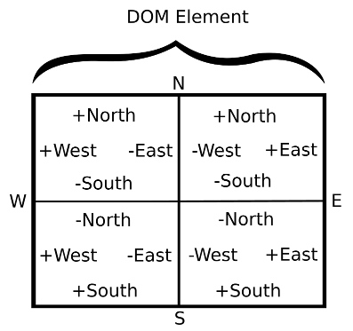

pointer-point
=============

Version 2 of pointer-point is a complete restructure of it's functionality. Version 1 documentation has been moved to the **onedocs.md** file in this project.

Install version 2
-----------------

`npm install pointer-point`

Constructor
-----------

### pointer(element|selector|array|array like)

Acceptable arguments to the constructor:

-	single element
-	single selector
-	array of elements and/or selectors
-	an array like (dom library) of elements

All elements get all events applied to them. When ever an event fires it will be on the applicable element. This means if you set three elements the `enter` event will fire for one of those element.

The Example
-----------

```javascript
var pointer = require('pointer-point'), divs = document.querySelectorAll('div');
//All of the div elements are added to the pointer.
var point = pointer(divs);
//Change the color for any of the divs depending on events.
point.on('down', function(current, rect){
    current.style.backgroundColor = 'red';
});
point.on('move', function(current, rect){
    if(this.inside(divs[2])){
        //Check some stuff when over the second div..
        console.log('this.h '+this.h);
        console.log('this.v '+this.v);
        console.log('this.speedX '+this.speedX);
    }
});
point.on('up', function(current, rect){
    current.style.backgroundColor = 'violet';
});
point.on('leave', function(current, rect){
    current.style.backgroundColor = 'violet';
});
point.on('enter', function(current, rect){
    current.style.backgroundColor = 'blue';
});
point.on('stroke', function(current, rect){
    console.log('stroke');
});

```

Alternatively pass an array
---------------------------

```javascript
//Add specific divs to the pointer.
var point = pointer([divs[1], divs[3]]);
```

Or just one element
-------------------

```javascript
var point = pointer(divs[0]);
```

Instance Methods
----------------

### destroy()

Removes all of the events for the pointer.

### inside(element)

Is this point inside of the element?

### outside(element)

Is this point outside of the element?

### add(element|selector)

Add one element, or one element from a selector to the instance.

### on(event, data|listener, listener)

Add an event to the point with a listener function.

The third argument is optional.

Some events use the data argument. When passing data you should also pass a callback in the third argument.

Look at the Events documentation to learn more about the data argument.

### off(event, listener)

Remove an event with the specified listener function.

Event listener
--------------

### listener(current, rect)

All events receive the current element the pointer is over, and when the pointer is down. If the pointer is not over an element passed to the pointer-point constructor `current` is null.

rect argument
-------------

All listeners receive a `rect` argument on the current element if there is one. If the pointer is not over an element that was passed to pointer-point constructor `rect` is null.

`rect` is an object that represents the current dismensions of the `current` element.

`rect` has the properties of element.getBoundingClientRect(), plus the additional x,y properties which may, or may not be available in certain environments. These are the properties of rect:

-	top
-	right
-	bottom
-	left
-	height
-	width
-	x
-	y

See [mozilla](https://developer.mozilla.org/en-US/docs/Mozilla/Tech/XPCOM/Reference/Interface/nsIDOMClientRect) for more.

The arguments current, or rect can be null depending on the situation.

### rect directions

The rect object also has north, south, east, and west properties.

These properties are oriented from the center of the current element, and are zero based.

Each direction has it's own number line.

Each direction is positive, or negative depending on which **quandrant** of a DOM element the pointer (mouse or touch) of **pointer-point** is in. Here is an image showing how the number lines work for these directions.



For instance crossing below the horizontal line makes `north` negative. Crossing above makes `north` positive. The numbers are the reverse for south. At the horizontal line south, and north are zero.

These **directions** can be used for controls that might need specific vectors. This can be helpful for things like pointer movements relative to the center of the element, and finding the positions of elements relative to the current element under the pointer.

Events
------

The term **pointer** refers to a mouse, or touch.

The term **mutual** means an event is dependent on if the pointer is over one of the elements.

Non-mutual events will sometimes have their `current`, `rect` arguments set to null if the pointer is not over an element. Some mutual events will get this effect too depending on where in the DOM the event fired.

This behavior of mutual events is hard to explain, but it is consistent so you shouldn't have a problem figuring out when this is applicable. **mutual** behavior is much like how traditional mouse events work except for the rect argument which only gets passed on `down`, or `enter` if the pointer went down on one of the elements passed to the constructor.

### down

The pointer went down. **mutual**

### up

The pointer went up. up is **mutual**, but can also fire when not over an element if the pointer was down when it was over that element.

### move

The pointer is moving. Unlike a normal `mousemove` this is fired globally.

### leave

The pointer leaves one of the elements. **mutual** even though it's leaving the element.

### enter

The pointer enters one of the elements. **mutual**

### stroke

The pointer is down, moving, and over one of the elements. **mutual**

`stroke` can fire after `down`, and `enter`.

### hold

`hold` uses the data argument. `hold` fires when the pointer is up after it has been down a certain time.

The default time is **two seconds**, or **2000 milliseconds**.

The hold examples:

```javascript
point.on('hold', function(element, rect){
    //Stuff
});
```

Or you can specify a **hold time** in **milliseconds**.

```javascript
//hold for 3 seconds.
point.on('hold', 3000, function(element, rect){
    //Stuff
});
```

Instance Properties
-------------------

### x, y

The coordinates of the pointer.

### h, v

When direction is the pointer moving from it's last position. Their values are strings.

h is the horizontal position (left, right). v is the vertical position (up, down).

### down

Is the pointer down.

### up

Is the pointer up.

### speedX

The pointer speed in pixels per second in the x axis.

### speedY

The pointer speed in pixels per second in the y axis.

**speedX, and speedY are experimental. Don't use these if you don't want your stuff to break.**

Instance Properties Effected By Down State
------------------------------------------

These properties are set to null when the pointer isn't down.

### current

The current element the pointer is over. This can still be set if the pointer went down then is moved outside the element. current is set to null on pointer up.

### origin

Set when the pointer went down over one of the elements passed to the constructor.

origin records the first element where the pointer went down.

### previous

Like origin, but records any elements the pointer leaves.

Caveats
-------

Internally pointer-point uses events to track pointer position so until the cursor is moved, or there is a touch there will be no x/y positions. This shouldn't be a problem in most situations.
